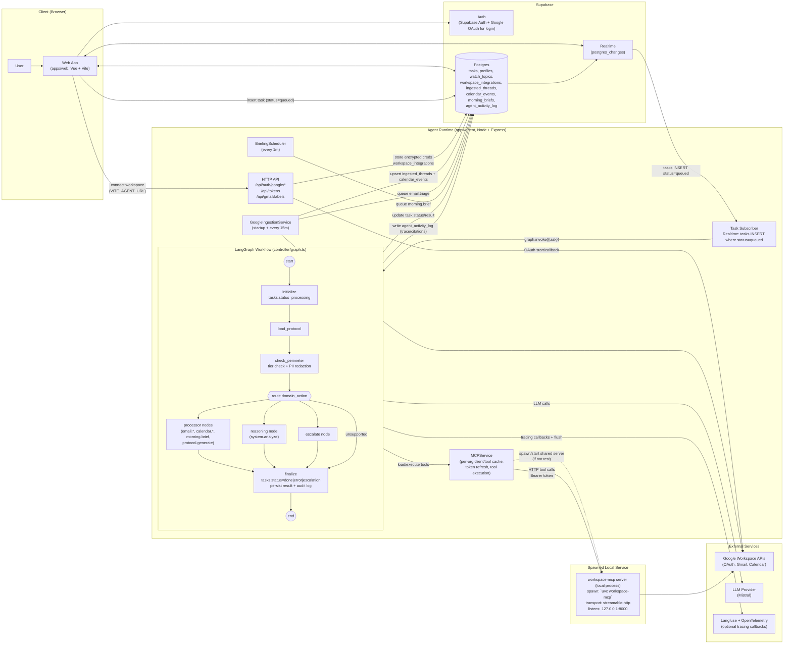

# App Orchestration (Mermaid)

```mermaid
flowchart LR
  %% Ai Assistant - Orchestration (with spawned local MCP service)

  subgraph Client["Client (Browser)"]
    U["User"]
    WEB["Web App<br/>(apps/web, Vue + Vite)"]
  end

  subgraph SB["Supabase"]
    AUTH["Auth<br/>(Supabase Auth + Google OAuth for login)"]
    DB[("Postgres<br/>tasks, profiles, watch_topics,<br/>workspace_integrations, ingested_threads,<br/>calendar_events, morning_briefs,<br/>agent_activity_log")]
    RT["Realtime<br/>(postgres_changes)"]
  end

  subgraph AG["Agent Runtime (apps/agent, Node + Express)"]
    API["HTTP API<br/>/api/auth/google/*<br/>/api/tokens<br/>/api/gmail/labels"]
    SUB["Task Subscriber<br/>Realtime: tasks INSERT where status=queued"]

    subgraph LG["LangGraph Workflow (controller/graph.ts)"]
      S((start))
      I["initialize<br/>tasks.status=processing"]
      LP["load_protocol"]
      PC["check_perimeter<br/>tier check + PII redaction"]
      R{{"route domain_action"}}
      PR["processor nodes<br/>(email.*, calendar.*, morning.brief,<br/>protocol.generate)"]
      RN["reasoning node<br/>(system.analyze)"]
      ES["escalate node"]
      F["finalize<br/>tasks.status=done|error|escalation<br/>persist result + audit log"]
      X((end))

      S --> I --> LP --> PC --> R
      R --> PR --> F --> X
      R --> RN --> F
      R --> ES --> F
      R -->|"unsupported"| F
    end

    ING["GoogleIngestionService<br/>(startup + every 15m)"]
    SCH["BriefingScheduler<br/>(every 1m)"]
    MCP["MCPService<br/>(per-org client/tool cache,<br/>token refresh, tool execution)"]
  end

  subgraph MCPLOCAL["Spawned Local Service"]
    MCPS["workspace-mcp server (local process)<br/>spawn: `uvx workspace-mcp`<br/>transport: streamable-http<br/>listens: 127.0.0.1:8000"]
  end

  subgraph EXT["External Services"]
    GOOGLE["Google Workspace APIs<br/>(OAuth, Gmail, Calendar)"]
    LLM["LLM Provider<br/>(Mistral)"]
    OBS["Langfuse + OpenTelemetry<br/>(optional tracing callbacks)"]
  end

  %% Web app auth + reads
  U --> WEB
  WEB --> AUTH
  WEB <--> DB
  WEB <--> RT

  %% DB-as-queue task orchestration
  WEB -->|"insert task (status=queued)"| DB
  DB --> RT
  RT -->|"tasks INSERT status=queued"| SUB
  SUB -->|"graph.invoke({task})"| LG

  %% Graph side effects + compute
  LG -->|"update task status/result"| DB
  LG -->|"write agent_activity_log (trace/citations)"| DB
  LG -->|"LLM calls"| LLM
  LG -->|"tracing callbacks + flush"| OBS
  LG -->|"load/execute tools"| MCP

  %% Spawned MCP server relationship
  MCP -. "spawn/start shared server\n(if not test)" .-> MCPS
  MCP -->|"HTTP tool calls\nBearer token"| MCPS
  MCPS --> GOOGLE

  %% Workspace OAuth (separate from Supabase login OAuth)
  WEB -->|"connect workspace\n(VITE_AGENT_URL)"| API
  API -->|"OAuth start/callback"| GOOGLE
  API -->|"store encrypted creds\nworkspace_integrations"| DB

  %% Background jobs
  ING --> GOOGLE
  ING -->|"upsert ingested_threads + calendar_events"| DB
  ING -->|"queue email.triage"| DB
  SCH -->|"queue morning.brief"| DB
```
