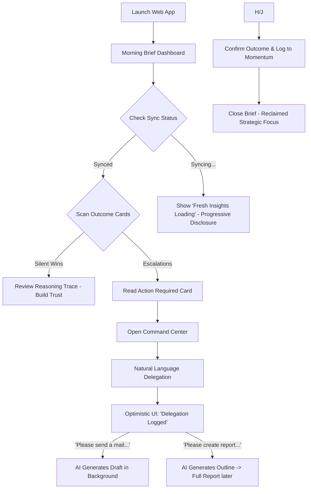
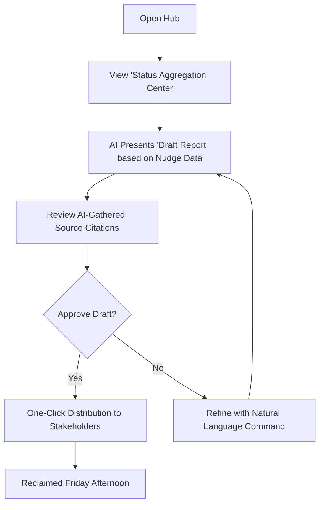
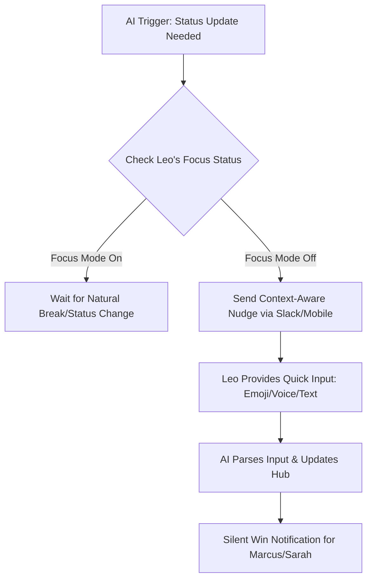

---
stepsCompleted:
  - 1
  - 2
  - 3
  - 4
  - 5
  - 6
  - 7
  - 8
  - 9
  - 10
  - 11
  - 12
  - 13
  - 14
lastStep: 14
inputDocuments:
  - C:/Users/othil/Documents/Project/Ai assistant/_bmad-output/planning-artifacts/prd.md
  - C:/Users/othil/Documents/Project/Ai assistant/_bmad-output/planning-artifacts/product-brief-Ai assistant-2026-01-09.md
---

# UX Design Specification Ai assistant

**Author:** Alexis
**Date:** Fri Jan 09 2026

---

<!-- UX design content will be appended sequentially through collaborative workflow steps -->

## Executive Summary

### Project Vision

Ai assistant is a high-agency, autonomous digital 'Chief of Staff' designed for SME leaders and project managers. It’s built to eliminate administrative friction by acting as a proactive Proxy Agent. Key innovations include Adaptive Relancing Protocols (personalized nudging philosophies), Agency Tiers (sharded permission levels for autonomous action), and a heavy focus on Executive Trust through transparency logs, source citations, and an 'Emergency Brake.'

### Target Users

- **The Overstretched CEO (Sarah):** Needs to offload routine triage and logistical management to reclaim strategic time.
- **The Scaling PM (Marcus):** Needs automated status aggregation and reporting to avoid the 'Friday Reporting' scramble.
- **The Team Member (Leo):** Needs a respectful, context-aware interface that gathers updates without disrupting deep work.

### Key Design Challenges

- **Building Immediate Trust:** Designing a UI that feels transparent and 'in control' even when the AI is acting autonomously.
- **Context-Switching for the Leader:** Ensuring the CEO can instantly jump from a high-level summary to the source data without friction.
- **Respecting Focus Time:** Crafting 'nudge' interactions that are effective but never annoying for team members.

### Design Opportunities

- **Visualizing 'Saved Time':** Creating a rewarding 'saved hours' dashboard that reinforces the value of the assistant.
- **Natural Language Protocol Interface:** Making the creation of 'nudging philosophies' feel as natural as talking to a real Chief of Staff.

## Core User Experience

### Defining Experience
The core experience is defined by a **"Review & Delegate" loop** powered by background automation. The primary daily touchpoint is the **Morning Brief**, a synthesized overview of business momentum and pending tasks. The secondary, high-frequency action is **Contextual Delegation**, where users provide natural language instructions (e.g., "Please send an email to this for that") that the AI executes within its authorized perimeter.

### Platform Strategy
- **Web & Desktop Application:** The primary interface for complex management, deep-dive transparency logs, and configuring the "Agency Perimeters" and "Nudging Protocols."
- **Mobile Experience:** A companion interface optimized for real-time delegation, quick triage, and receiving "Silent Win" notifications or escalation alerts.

### Effortless Interactions
- **Autonomous Data Gathering:** The system automatically pulls from Google Workspace, Slack, and other connected channels to build the Morning Brief and status reports without user intervention.
- **Automated Nudge Management:** The AI handles the entire lifecycle of "follow-ups" based on the user's defined philosophy, pausing only when a blocker is detected or an agency tier is exceeded.
- **Natural Language Delegation:** High-accuracy processing of conversational requests into actionable drafts or executed tasks.

### Critical Success Moments
- **The First Automated Win:** When the user receives a status report that was generated 100% automatically with 0% manual effort.
- **The 'Trust Leap':** Moving a recurring task from manual approval to autonomous proxy after seeing the AI handle it perfectly in "Shadow Mode."
- **The Context-Rich Escalation:** Receiving a nudge about a complex problem that includes the exact source links and reasoning, allowing for a 10-second decision.

### Experience Principles
- **Background Intelligence, Foreground Simplicity:** The complexity of data gathering is hidden; the user only sees the actionable synthesis.
- **Agency is Earned:** The UI defaults to transparency and "Shadow Mode" to build trust before asking for autonomous permissions.
- **Focus Protection:** The automation respects the human "Focus Mode," ensuring the AI is a helpful partner, not a source of noise.

## Desired Emotional Response

### Primary Emotional Goals
- **Proactive Calm:** The user feels a steady sense of control, knowing that the "background engine" is monitoring, gathering, and preparing everything.
- **Total Cognitive Offloading:** The "mental checklist" of follow-ups and routine logistics is completely moved to the AI, freeing up cognitive bandwidth for high-level strategy.
- **Improved Will & Purpose:** After the Morning Brief, the user feels energized and focused, with a clear understanding of the day's strategic priorities rather than being buried in administrative noise.

### Emotional Journey Mapping
- **Discovery:** **Hope.** "Could this finally be the partner I need to stop the burnout?"
- **The Morning Brief:** **Clarity & Purpose.** Moving from a foggy overview to a sharp, actionable vision of the day.
- **The Core Delegation:** **Certainty.** A feeling of "I said it, and now it’s as good as done."
- **Return/Daily Ritual:** **Reassurance.** The product becomes a comforting anchor in a busy executive's life.

### Micro-Emotions
- **Trust (Critical):** Built through the "Reasoning Trace" and "Source Citations."
- **Relief:** Felt during "Silent Wins" when a conflict is resolved autonomously.
- **Respect:** Felt by team members through context-aware nudges that protect their "Deep Work."

### Design Implications
- **Calm via Minimalism:** A clutter-free Web Dashboard with a focus on negative space and clear typography. Avoiding "anxiety-inducing" UI elements (e.g., bright red notification dots for routine items).
- **Offloading via Visibility:** Making the "background work" visible through a "Silent Win" log, so the user *knows* the AI is working even when they aren't interacting with it.
- **Will via Actionability:** The Morning Brief shouldn't just be information; it should be a springboard to the most impactful actions of the day.

### Emotional Design Principles
- **Lead with the Signal:** Always present the most important insight first to minimize the effort required to reach "Clarity."
- **Silence is Golden:** If nothing requires the user's attention, the UI should reflect that peace, reinforcing the sense of "Offloading."
- **The Human Touch:** The conversational tone should be professional yet empathetic, mirroring a high-tier human Chief of Staff.

## UX Pattern Analysis & Inspiration

### Inspiring Products Analysis

- **Trello (Organizational Clarity):**
    - **What it does well:** Uses a "Card and Board" metaphor to make complex progress feel spatial and manageable.
    - **Transferable Lesson:** We can use "Task Cards" in the Morning Brief that have a clear state (Pending, Handled, Escalated), making business momentum visually trackable.
- **Duolingo (Expressive Personality):**
    - **What it does well:** Uses personality, celebrate-able moments, and a conversational tone to turn a "chore" (learning) into a "delight."
    - **Transferable Lesson:** The AI's "voice" should be expressive and encouraging. We can use "Celebratory Wins" when the AI saves Sarah 5+ hours in a week, using Duolingo-style positive reinforcement.
- **Material UI 3 (Modern System):**
    - **What it does well:** "Material You" focus on personalization, expressive color palettes, and clean, accessible components.
    - **Transferable Lesson:** We can use dynamic color-theming based on the "State of the Business" (e.g., a calming teal when things are on track, a focused amber when there are blockers).

### Transferable UX Patterns

- **Spatial Organization (from Trello):** Using a "Dashboard Board" for the Morning Brief where status items are grouped by their "Outcome" state.
- **Expressive Feedback (from Duolingo):** Using small, delightful animations or celebratory micro-copy when a "Silent Win" is logged.
- **Personalized Expressivity (from MUI3):** Leveraging "Material You" style personalization to make the Chief of Staff feel unique to the user's specific leadership style.

### Anti-Patterns to Avoid

- **The "Boring Dashboard" (Avoid):** Moving away from dry, data-heavy tables that feel like more "work" to read.
- **The "Uncanny Valley" Mascot (Avoid):** Ensuring the "Expressive" nature doesn't feel childish or intrusive—it should feel like a high-end partner, not a toy.
- **Notification Overload (Avoid):** Learning from Duolingo's persistence, we must ensure our "Nudges" are persistent but never annoying, respecting the "Focus Mode" we defined earlier.

### Design Inspiration Strategy

- **What to Adopt:** Trello's "Card" metaphor for status items and MUI3's expressive, accessible component library.
- **What to Adapt:** Duolingo's "Engagement" engine—adapting it from "daily streaks" to "weekly momentum/time saved" metrics to keep the executive motivated.
- **What to Avoid:** The "spreadsheet-ification" of AI data; we want to keep everything feeling human, conversational, and spatial.

## Design System Foundation

### 1.1 Design System Choice
**Themeable Material UI 3 (MUI)**

We will use **MUI (Material UI)** as our primary component library, specifically leveraging its **Material Design 3 (MUI v6+)** implementation. This provides a robust foundation of accessible, high-performance components while allowing for deep visual customization.

### Rationale for Selection
- **Material You Integration:** MUI 3 perfectly supports the "Material You" philosophy, allowing us to implement the expressive, personalized color palettes that Alexis loves.
- **Speed & Reliability:** By using a proven system, we can focus our creative energy on the unique "expressive" interactions (like the Morning Brief) rather than reinventing standard buttons and inputs.
- **Cross-Platform Consistency:** MUI’s responsive design patterns will ensure a seamless transition from the Web/Desktop management hub to the Mobile companion experience.
- **Accessibility:** Built-in compliance ensures the "Chief of Staff" is inclusive and usable for all SME leaders.

### Implementation Approach
- **MUI Theme Provider:** We will establish a master `ThemeProvider` that defines our core tokens (typography, spacing, and color).
- **Dynamic Color Tokens:** Utilizing Material 3's color system to generate harmonious palettes that can shift based on the "state of the business" (e.g., calming vs. focused).
- **Responsive Layouts:** Leveraging MUI's Grid and Box systems to maintain the Trello-style spatial clarity across different screen sizes.

### Customization Strategy
- **Expressive Geometry:** We will customize MUI’s default border-radii to be slightly more rounded and "friendly," leaning into the Duolingo-style approachability.
- **Tailored Motion:** We will replace standard transitions with more "expressive" and purposeful motion patterns that reinforce the feeling of "proactive calm."
- **Component Extensions:** For unique needs like the "Morning Brief Cards" or "Agency Tier Toggles," we will extend base MUI components with custom styling and logic.

## 2. Core User Experience

### 2.1 Defining Experience
The **Outcome-Centric Morning Brief** is the product's North Star. It is a synthesized, card-based overview of the business's momentum, delivered every morning. Unlike traditional "triage" feeds, it focuses exclusively on **Outcomes**: what was resolved autonomously, what blockers were detected, and what strategic decisions require the user's focus. It turns the "morning inbox dread" into a "morning victory lap."

### 2.2 User Mental Model
- **Current Approach:** Users currently start their day by "hunting" for status across Gmail, Slack, and Calendar, manually piecing together what happened and what needs to happen.
- **New Mental Model:** The user treats the Morning Brief as their "Chief of Staff's Daily Report." They expect the AI to have already done the hunting and synthesis, allowing them to shift from "Information Gathering" to "Strategic Decision Making."
- **Expectation:** If it’s in the brief, it’s a signal; if it’s not, the user can trust that it’s being handled in the background.

### 2.3 Success Criteria
- **The "Aha!" Moment:** Seeing at least one "Silent Win" (a conflict resolved autonomously) in the first 30 seconds of reading.
- **Cognitive Release:** The user closes the brief feeling 100% confident they haven't missed anything critical.
- **Clarity of Purpose:** The brief highlights exactly **one to three** high-impact actions, eliminating the "choice paralysis" of a long to-do list.
- **Verifiability:** Every item in the brief has a deep-link "Source Citation," allowing the user to verify the reasoning in one tap.

### 2.4 Novel UX Patterns
- **Outcome-Based Filtering:** Sorting information by "Status of Outcome" rather than "Time Received" or "Source Platform."
- **The "Reasoning Trace" Card:** A novel pattern that shows the AI's "internal thought process" for autonomous actions, building trust through transparency.
- **Agency Perimeter Visualization:** A visual indicator on each card showing which "Tier" of agency was used (e.g., Tier 1: Public/Autonomous).

### 2.5 Experience Mechanics
1.  **Initiation:** The Brief is ready and waiting at the user's defined "Start of Day" (Web) or delivered as a notification (Mobile).
2.  **Interaction:** The user scrolls through expressive, Material 3 cards. Each card uses Trello-style spatial clarity:
    - **Green/Calm Card:** "Silent Win" (Resolved for you).
    - **Amber/Focus Card:** "Escalation" (Needs your 10-second decision).
    - **Indigo/Info Card:** "Briefing" (Crucial context for your day).
3.  **Feedback:** The user can "acknowledge" a win (Duolingo-style delight) or "delegate" an escalation (Conversational input).
4.  **Completion:** A summary shows "Total Time Saved" for the day, and the user transitions into their high-value work with a sense of **Improved Will.**

## Visual Design Foundation

### Color System
**Theme: Executive Calm**
The color palette is designed to reinforce trust and reduce cognitive anxiety. We use deep, "grounded" colors for the interface and clear, semantic colors for status.

- **Primary:** `Indigo (#334155)` — Used for headers and primary branding to represent stability and intelligence.
- **Background:** `Soft Grey (#F1F5F9)` — A cool-toned, airy background that reduces eye strain and provide a clean canvas.
- **Surface:** `Pure White (#FFFFFF)` — Used for cards and interactive elements to create a clear spatial hierarchy.
- **Success (The "Silent Win"):** `Deep Teal (#059669)` — A calm, professional green used to signal autonomously resolved tasks.
- **Warning (The "Escalation"):** `Muted Amber (#D97706)` — A clear but non-alarming yellow used for items requiring a decision.
- **Information:** `Clear Blue (#2563EB)` — Used for neutral briefing insights and context.

### Typography System
We use a dual-font strategy to balance modern elegance with technical reliability.

- **Primary UI & Headings:** `Inter` — A clean, modern sans-serif designed for high-precision interfaces. It provides excellent readability at all sizes and feels "Executive."
- **Secondary & Technical Body:** `Roboto` — A familiar, reliable typeface used for "Reasoning Traces," logs, and source citations, reinforcing the AI's technical accuracy.
- **Scale:**
    - **H1 (Morning Brief):** 32px / Bold — The emotional anchor of the day.
    - **H3 (Card Titles):** 18px / Semi-Bold — Clear outcome labeling.
    - **Body:** 14px / Regular — Optimal for scanning high-density information with 1.6x line-height for "Calm" readability.

### Spacing & Layout Foundation
- **The 8px Grid:** All spacing, margins, and component dimensions follow a base 8px unit to ensure mathematical harmony and consistent "spatial clarity."
- **Airy Layout:** We prioritize "Negative Space" around cards to prevent the UI from feeling cluttered or overwhelming.
- **Card Geometry:** Moderate corner radii (12px) to feel modern and friendly without losing the professional edge.

### Accessibility Considerations
- **High Contrast:** All text on primary/status colors will maintain a minimum 4.5:1 contrast ratio (AA standard).
- **Redundancy:** Status is never communicated by color alone; we use icons (dots/icons) and clear text labels (e.g., "Silent Win") to ensure accessibility for all users.
- **Focus States:** High-visibility focus rings in `Indigo` ensure keyboard navigability for the Desktop/Web experience.

## Design Direction Decision

### Design Directions Explored
We explored four distinct visual and interactive directions for the Ai assistant:
1.  **The Structured Hub:** A high-efficiency dashboard focusing on organizational clarity and outcome-based cards.
2.  **The Conversational Partner:** A dialogue-driven interface emphasizing natural language delegation.
3.  **The Outcome Board:** A spatial, Trello-inspired layout focusing on the movement of tasks.
4.  **The Minimalist Pulse:** A high-precision, low-noise interface for critical signals only.

### Chosen Direction
**Direction 1: The Structured Hub**

We have selected the **Structured Hub** as our primary design direction. This layout provides a persistent sidebar for navigation and a clear, grid-based main stage for the **Morning Brief**.

### Design Rationale
- **Clarity of Status:** The Hub layout allows the user to see the "state of the business" at a single glance, supporting the goal of **Proactive Calm**.
- **Outcome-Centric:** The card-based grid is the ideal format for our "Silent Wins" and "Escalations," making each item feel discrete and actionable.
- **Scalability:** This structure easily accommodates future complexity, such as deep-dive transparency logs, agency perimeter management, and multi-tenant administration.
- **Executive Feel:** The layout mirrors high-end professional tools, reinforcing the "Chief of Staff" persona.

### Implementation Approach
- **MUI Layout Components:** We will use MUI's `Drawer` for the persistent sidebar and `Grid2` for the responsive outcome cards.
- **Card Hierarchy:** We will implement a standard "Outcome Card" template that can be color-coded (Executive Calm palette) based on the task status.
- **Mobile Adaptation:** The sidebar will transform into a "Bottom Navigation" or "Hamburger Menu" on mobile to maintain the Hub's organizational clarity on smaller screens.

## User Journey Flows

### 1. Sarah's "Review & Delegate" Victory Lap
This journey transforms the "Morning Dread" into a structured execution session with built-in trust and progressive momentum.

### 2. Marcus's "Reporting Scramble" Solver
Marcus uses the automation of the Hub to eliminate the manual labor of status aggregation.

### 3. Leo's "Respected Focus" Journey
The team-side experience ensures the AI gathers the data Marcus needs without bothering Leo.

### Journey Patterns
- **The Command Pattern:** All high-agency actions use the same Natural Language "Command Center" interface for consistency.
- **The Reasoning Trace:** Every autonomous action or AI suggestion is accompanied by a transparent "Why" to build user trust.
- **The Context-Aware Delay:** Nudges respect the recipient's focus state, preventing organizational noise.

### Flow Optimization Principles
- **Progressive Delivery:** For complex tasks, the AI delivers a skeleton draft immediately to maintain the sense of momentum.
- **Sync Transparency:** Visual indicators ensure the user knows their data is fresh, preventing "Stale Brief" anxiety.
- **Optimistic Delegation:** The UI acknowledges requests instantly, reinforcing the feeling of "Total Cognitive Offloading."

## Component Strategy

### Design System Components
We will leverage **Material UI 3 (MUI)** for all foundational UI elements to ensure accessibility and performance.
- **Layout:** `Box`, `Stack`, `Grid2` for the Structured Hub framework.
- **Navigation:** `Drawer` for the persistent sidebar and `Breadcrumbs` for deep-dive tracking.
- **Feedback:** `CircularProgress` for the "Sync Trust" indicator and `Alert` for system messages.
- **Input:** `Switch` and `Slider` for fine-tuning "Agency Confidence Thresholds."

### Custom Components

#### 1. The Outcome Card
- **Purpose:** The primary block of the Morning Brief. Handles Wins, Actions, and Insights.
- **Interactions:** One-tap "Acknowledgment" or "Escalation Response." Opens the Reasoning Trace Pane.
- **Visuals:** Uses the *Executive Calm* palette.

#### 2. Reasoning Trace Pane
- **Purpose:** Shows the AI's internal thought process and source citations.
- **Anatomy:** Vertical timeline of logic steps with deep links to source messages/docs.
- **Usage:** Slide-out drawer triggered from an Outcome Card.

#### 3. Natural Language Command Center
- **Purpose:** A conversational input field for delegation.
- **Special Feature:** "Progressive Preview" shows a skeleton outline of complex artifacts as the user types.

#### 4. Agency Perimeter Manager
- **Purpose:** Visualizes and edits sharded permission tiers.
- **Anatomy:** Column-based "Tier Board" for dragging topics between perimeters.

### Component Implementation Strategy
- **Token-Driven:** Custom components consume MUI `ThemeProvider` tokens for harmony.
- **Optimistic UI:** Command Center acknowledges requests instantly.
- **Mobile-First Adaptation:** Simplified, touch-optimized variants for the companion app.

### Implementation Roadmap
- **Phase 1 (Core):** Outcome Card, Structured Hub Layout, Command Center (Essential for MVP).
- **Phase 2 (Trust):** Reasoning Trace Pane, Sync Status Indicators.
- **Phase 3 (Admin):** Agency Perimeter Manager, Advanced Reporting Components.

## UX Consistency Patterns

### Button Hierarchy & Interactions

To maintain "Executive Trust," every interaction follows a predictable hierarchy that respects the user's focus.

- **Primary Action (Acknowledgment):** Contained button using `Indigo (#334155)`. Reserved for the "final word" on an outcome or task.
- **Secondary Action (View Trace):** Outlined button with `Indigo` text. Triggers the **Accordion Reasoning** to show the AI's internal thought process.
- **Tertiary/Ghost (Dismiss/Archive):** Text-only button for clearing non-essential insights, minimizing visual weight.
- **The "Emergency Brake":** A persistent, high-visibility (but elegantly integrated) "Safety" toggle in the header. It is never hidden, ensuring Sarah always feels in control of her autonomous proxy.

### Feedback Patterns: The Language of Momentum

We use a combination of color, motion, and "Progressive Brevity" to communicate status without creating anxiety.

- **"Silent Win" (Success):** Uses `Deep Teal (#059669)`.
    - **Visual:** A subtle "Resting Heart Rate" pulse (60bpm). To prevent visual noise, the pulse only applies to the top 3 most recent or high-impact wins; older wins remain static.
    - **Copy:** Celebratory but professional (e.g., *"I've handled this for you"*).
- **"Escalation" (Action Required):** Uses `Muted Amber (#D97706)`.
    - **Framing:** Uses **Reverse Delegation** ("I need your human touch on this").
    - **Copy:** Applies **Progressive Brevity**. New users receive detailed explanations; experts receive shorthand (e.g., *"Blocker: Decision needed"*).
- **"Briefing" (Information):** Uses `Clear Blue (#2563EB)` for neutral insights requiring scan-level attention.

### Navigation Patterns: Agency via Choice

The assistant provides a guided experience while allowing the executive to "break out" when needed.

- **The Decision Flow (Primary):** A linear, card-by-card feed for the Morning Brief, optimized for focus and "Review & Delegate" momentum.
- **Grid View (Secondary):** A spatial, Trello-inspired toggle that allows users to skim all outcomes and "cherry-pick" what to address first.
- **Accordion Reasoning:** Instead of side-drawers, reasoning traces expand in-line within the card flow. This maintains the user's vertical scroll position and prevents context-switching fatigue.

### Empty & Loading States: Silence is Golden

Our "Proactive Calm" philosophy means that silence is a feature, not a bug.

- **The "All Clear" Screen:** When no actions are needed, the Hub displays a minimalist, calming illustration with a reassurance label: *"The engine is running. Your day is in balance."*
- **Momentum Recap:** Empty states include a "Weekly Time Saved" metric to reinforce the value of background automation.
- **Trust-Building Loader:** For syncs taking >2 seconds, the loader displays "Nightly Shift" stats (e.g., *"Gathering data... I resolved 3 threads while you slept"*). If the sync is instant (<500ms), the loader is skipped entirely to prioritize speed.

### Form & Command Input

- **Natural Language Command Center:** A persistent input field for delegation.
- **Progressive Preview:** As the user types, a skeleton outline of the intended artifact (email draft, report outline) appears to provide immediate momentum.

## Responsive Design & Accessibility

### Responsive Strategy

The Ai assistant experience scales based on the user's intent and context of use.

*   **Desktop (The Command Center):** 
    *   **Layout:** A three-pane "Structured Hub" layout. The left pane is a persistent navigation sidebar; the center pane is the focused **Decision Flow**; the right pane is an optional, persistent **Reasoning Trace** or **Momentum Sidebar**.
    *   **Focus:** High-precision management and deep-dive transparency. We prioritize "Calm White Space" to prevent information overload on large screens.
*   **Tablet (The Interactive Brief):**
    *   **Layout:** Two-column layout. The sidebar collapses into a "Hamburger Menu" or "Mini-rail." 
    *   **Interaction:** Touch-optimized "Outcome Cards" with larger hit areas. Accordion reasoning is the primary way to view traces.
*   **Mobile (The Triage Partner):**
    *   **Layout:** Single-column, vertical feed. Uses **Bottom Navigation** for primary actions (Home, Search, Delegate, Profile).
    *   **Focus:** Quick triage and real-time alerts. Critical information is delivered via "Summary Notifications" on the lock screen.

### Breakpoint Strategy

We utilize Material Design 3 (MUI) standard breakpoints to ensure a reliable and predictable layout transition.

*   **Extra-Small (Mobile):** 0px - 599px
*   **Small/Medium (Tablet):** 600px - 899px
*   **Large (Desktop):** 900px - 1199px
*   **Extra-Large (Wide Desktop):** 1200px+ (Maximized "Calm" margins)

### Accessibility Strategy

We aim for **WCAG 2.1 Level AA** compliance to ensure the "Chief of Staff" is a partner for every leader.

*   **Visual:** All text in the **Executive Calm** palette maintains a minimum 4.5:1 contrast ratio. Status is communicated through color + icons + labels (triple redundancy).
*   **Navigation:** Full keyboard support with visible focus rings for desktop users. "Skip to Content" links are provided for screen reader efficiency.
*   **Motor:** Minimum touch target sizes of 48x48dp for all interactive elements on mobile and tablet.
*   **Cognitive:** "Progressive Brevity" ensures the system adapts to the user's expertise level, reducing cognitive load over time.

### Testing Strategy

*   **Device Lab:** Testing on actual iOS and Android devices for mobile-first triage performance.
*   **Automated Audits:** Integrating `axe-core` for continuous accessibility monitoring.
*   **User Validation:** Testing with screen readers (VoiceOver/NVDA) to ensure "Reasoning Traces" are logically narrated.

### Implementation Guidelines

*   **Relative Units:** Developers must use `rem` for typography and `%`/`vw` for layout containers.
*   **Semantic HTML:** Use proper `<main>`, `<nav>`, and `<section>` tags to provide a logical document outline for assistive tech.
*   **ARIA Patterns:** Implement `aria-expanded` for accordion reasoning and `aria-live` for real-time "Silent Win" updates.
